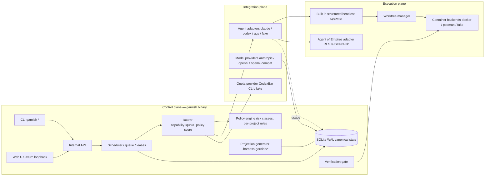

# Architecture

Three planes with explicit boundaries. The control plane is deterministic
wherever policy can be deterministic; an LLM may propose plans or routes but
can never override hard policy.



## Control plane

Owns projects, task DAGs, scheduling, routing, quota snapshots, policies,
approvals, state transitions, memory projections, run manifests, verification
gates, and recovery. Single Rust binary (`garnish`), optional daemon mode
(`garnish daemon start`). All state changes go through the internal API so
CLI, web UX, and daemon share one policy path.

## Execution plane

Owns process execution, worktrees, containers, capture, cancellation,
heartbeats, cleanup.

- **Structured headless (built-in, MVP default):** spawn the agent CLI
  directly with argv arrays — `codex exec` (JSONL events), `claude -p`
  (stream-JSON), `agy --print` — inside a per-task git worktree; project
  build/test commands run in the task container. Exit codes, timeouts,
  SIGTERM→SIGKILL escalation, output limits, child-process-group cleanup.
- **Supervised PTY (composed):** Agent of Empires behind the `ExecutionPlane`
  trait — session create (worktree+sandbox flags), `send`, `output`, ACP
  JSON-lines transcripts where available. Version-pinned; replaceable
  (ADR-0002).

## Integration plane

Agent adapters, model providers, quota providers, container backends —
all behind versioned traits declaring capabilities (docs/contracts.md). Name
tells you nothing; declared capabilities and probed versions decide what a
component may be asked to do. `garnish doctor` probes every integration.

## Platform matrix

| | macOS arm64 | Ubuntu 24 (VPS) | WSL2 |
|---|---|---|---|
| garnish binary | native | musl static | Linux musl static |
| Docker | Docker Desktop (VM) | dockerd | Docker Desktop/WSL or dockerd |
| Podman | not required | rootless — primary test target | supported, tested on VPS |
| Subscription CLIs | host | host | host (Linux side) |
| CodexBar CLI | tarball | Linux tarball | Linux tarball |
| AoE + tmux | optional | optional | optional |

## Repository layout (planned, Phase 1)

```
crates/
  garnish-core/      state, schema, migrations, task machine, policy, events
  garnish-exec/      worktrees, container backends, headless spawner, AoE adapter
  garnish-agents/    agent adapters + fake agent
  garnish-providers/ model providers, quota providers, cost tracking
  garnish-cli/       clap CLI (binary: garnish; src/web.rs = axum web UX,
                     src/bin/ = fake-agent + garnish-api-agent)
docs/                this documentation and ADRs
fixtures/            recorded CLI outputs for drift tests, fake-agent scripts
```
